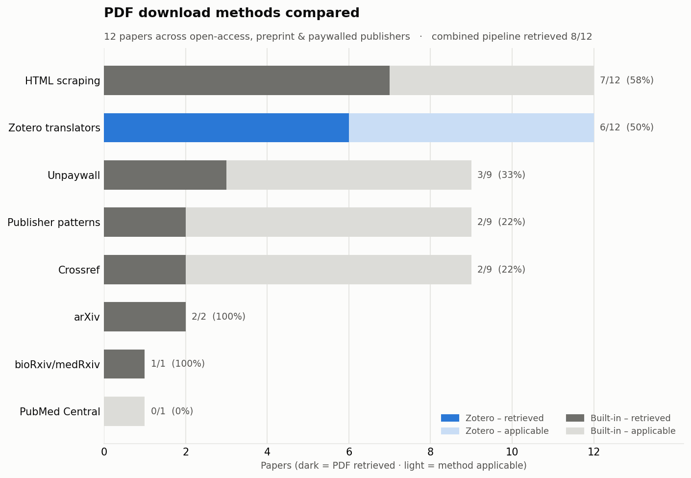

# Review Buddy

Search and download academic papers from multiple sources with intelligent fallback strategies.

## Features

- **5 Search Sources**: Scopus, PubMed, arXiv, Google Scholar, IEEE Xplore
- **Smart Deduplication**: Merges results across sources automatically
- **Abstract-Based Filtering**: Remove unwanted papers (non-English, animal studies, reviews, etc.)
- **Zotero-powered downloads**: Zotero translators as the primary PDF fetcher, with a fallback chain (arXiv, bioRxiv, Unpaywall, PMC, Crossref, publisher patterns, HTML scraping, Sci-Hub optional)
- **Parallel downloading**: configurable multi-worker PDF fetching
- **Multiple Formats**: BibTeX, RIS, CSV export
- **Production Ready**: Comprehensive error handling and logging

## Quick Start

**1. Install dependencies:**
```bash
pip install -r requirements.txt
```

**2. Configure API keys:**
```bash
cp .env.example .env
# Edit .env and add at least one API key
```

**3. Configure your run:**
```bash
cp config.example.yaml config.yaml   # then edit config.yaml (query, filters, toggles)
```

**4. Run — either the whole pipeline at once:**
```bash
python main.py                  # fetch → keyword-filter → download, in one command
python main.py --ai             # use the LLM filter (serves Ollama for you)
python main.py --skip-download  # stop after filtering
```

`main.py` preflight-checks every dependency each step needs, auto-starts the
services it can (the Zotero translation server; Ollama, including pulling the
model for `--ai`), prints an exact fix for anything missing, and reports the
time each step took. If launched from an env missing dependencies, it tries to
re-exec itself under the `autosearch` conda env.

**...or the steps individually:**
```bash
python 01_fetch_metadata.py     # Search papers
python 02_abstract_filter.py    # Filter by abstract (optional)
python 03_download_papers.py    # Download PDFs
```

> **Measured** (25 results each from Scopus + PubMed + arXiv, university network,
> browser fetcher on): 61 unique papers fetched + filtered in **~8s**, then
> **47/56 PDFs (84%)** downloaded — 33 via the fast HTTP/Zotero path, 14 via the
> real browser. The misses are subscription walls (ACM, APA, some Elsevier).

**Optional: AI-powered filtering with Ollama** 

For more sophisticated filtering, use `02_abstract_filter_ai.py` with a local LLM (Ollama). This provides:
- Natural language filter definitions (no regex patterns needed)
- Confidence scores and reasoning for each decision
- Customizable filters for your specific review criteria
- Automatic flagging of uncertain papers for manual review

**Quick setup:**
```bash
# 1. Install Ollama (if not already installed)
# Visit https://ollama.ai and follow installation instructions for your OS

# 2. Pull a model (one-time)
ollama pull gemma3:4b

# 3. Start Ollama server (in a separate terminal)
ollama serve

# 4. Run AI filtering (main.py --ai starts Ollama and pulls the model for you)
python main.py --ai
# ...or run just this step directly:
python 02_abstract_filter_ai.py
```

**How long it takes.** The LLM is called once per paper with an abstract, so
runtime scales linearly with corpus size. Measured on a 6GB-VRAM laptop GPU:

| model | per paper | per 1000 papers | agreement with hand labels |
|-------|-----------|-----------------|----------------------------|
| `gemma3:4b`   | ~7-16s | ~2-4.5h | 0.906 |
| `gemma3:12b`  | ~37s   | ~10h    | 0.935 |
| `gpt-oss:20b` | ~20s   | ~5.5h   | 0.971 |

A few thousand abstracts is an overnight job, not a coffee break. Responses are
cached under `results/ai_cache/`, so an interrupted run resumes cheaply and
re-runs are near-instant. The cache key includes the model name and the filter
set, so changing either correctly forces a re-evaluation rather than silently
reusing the old verdicts.

Use `gemma3:4b` while you are still iterating on filter wording, then do the
final pass with `gpt-oss:20b` if the extra accuracy is worth the wall time.

**Output files:**
- `papers_filtered_ai.csv` / `references_filtered_ai.bib` - Filtered papers
- `manual_review_ai.csv` - Papers flagged for manual review (low confidence)
- `ai_filtering_log_*.json` - Detailed decision log with confidence scores

**Compare filtering strategies:**
```bash
python scripts/compare_filters.py  # Compare AI vs keyword filtering results
```

**HPC/Cluster users**: See `run_filter_hpc.sh` for a SLURM job script example that manages the Ollama server automatically.

Results in `results/` folder: `papers.csv`, `references.bib`, `references.ris`, `pdfs/`

**Note:** The download script automatically uses filtered results if available:
- `references_filtered.bib` (keyword filtering) is checked first
- Falls back to `references.bib` (unfiltered) if no filtered version exists
- To use AI-filtered results, rename `references_filtered_ai.bib` to `references_filtered.bib`, or update the path in `03_download_papers.py`

## Configuration

**All run options live in one file: `config.yaml`.** Query, year range, sources,
filters, and download toggles are set there — not by editing the `.py` scripts —
so your settings never clutter git history (`config.yaml` is gitignored).

```bash
cp config.example.yaml config.yaml    # one-time; then edit config.yaml
```

`config.yaml` only needs the keys you want to change; everything else falls back
to the documented defaults in `config.example.yaml`. Example:

```yaml
search:
  year_from: 2018
  sources: [pubmed, arxiv]
download:
  use_browser: true
  max_workers: 8
```

API keys and emails are the exception — those stay in `.env` (secrets, not run
settings). See below.

### API Keys (at least one required)

**Scopus**: Get from [Elsevier Developer Portal](https://dev.elsevier.com/)  
**PubMed**: Use any valid email (free, no registration)  
**IEEE** (optional): Get from [IEEE Developer Portal](https://developer.ieee.org/)

**arXiv and Google Scholar work without keys.**

Edit `.env`:
```bash
SCOPUS_API_KEY=your_key_here
PUBMED_EMAIL=your.email@example.com
UNPAYWALL_EMAIL=your.email@example.com  # Optional, for open access papers
```

## Query Syntax

Set your query in `config.yaml` (`search.query`), or leave it null to read from
`query.txt` (handy for long boolean queries):

| Operator | Example | Result |
|----------|---------|--------|
| **AND** | `machine learning AND healthcare` | Both terms required |
| **OR** | `neural networks OR deep learning` | Either term |
| **NOT** | `AI NOT reinforcement` | Exclude term |
| **" "** | `"machine learning"` | Exact phrase |
| **( )** | `(AI OR ML) AND diagnosis` | Grouping |

**Inline query** (in `config.yaml`):
```yaml
search:
  query: "machine learning AND healthcare"
```

**From text file** (leave `query` null; supports multi-line boolean queries):
```yaml
search:
  query: null
  query_file: query.txt
```

**Examples:**
```python
"machine learning healthcare"                      # Implicit AND
"(COVID-19 OR coronavirus) AND diagnosis"          # Boolean logic
'"deep learning" AND "medical imaging"'            # Exact phrases
"AI AND cardiology NOT review"                     # Exclusion
```

**📖 More examples**: See [Query Syntax Guide](docs/QUERY_SYNTAX.md)

## PDF Download

**Primary fetcher: Zotero's resolver chain**

Review Buddy reproduces what the Zotero desktop app does when you paste DOIs into
*Add Item(s) by Identifier*. Importantly, **the translators do not download the
PDF** — they are page parsers used at the *last* step. The heavy lifting is a
resolver chain (`doi` → `url` → `PMCID` → **Zotero's own open-access index**),
and only then are the translators run on the resulting landing page to extract
the PDF link.

> 📖 **[How Zotero actually downloads PDFs](docs/ZOTERO_HOW_IT_WORKS.md)** — the
> full mechanism, with the source references and why a script still loses to the
> desktop app on Cloudflare-protected publishers. Read this if you want to
> explain or extend the behaviour.

Zotero's OA index (`services.zotero.org/oa/search`) needs **no local server** and
finds copies plain Unpaywall misses. The optional translation server adds the
site-specific extraction step; it is vendored as a git submodule:

```bash
python scripts/setup_zotero.py           # init submodule, npm install, apply patch
cd vendor/translation-server && node src/server.js   # start it (leave running)
```

> **Note:** the setup script applies a small required patch (`vendor/patches/expose-attachments.patch`).
> Upstream translation-server strips PDF links from its `/web` response; the
> patch re-exposes them. This makes the submodule show as "modified" in git — that
> is expected.

If the server is not running, the downloader logs a notice and **silently falls
back** to the built-in strategies below, so Zotero is entirely optional. The
server URL can be changed via `ZOTERO_TRANSLATION_SERVER` in `.env`.

For paywalled content, Zotero only *finds* the PDF link — you still need network
access to the publisher (e.g., campus network or VPN) to download it.

**Parallelism:** downloads run across several workers (default 4). Set
`MAX_WORKERS = 1` in `03_download_papers.py` for sequential behaviour.

**Real-browser fetcher (optional, closes most of the remaining gap):** for
Cloudflare-protected publishers (Elsevier/ScienceDirect, Wiley, MDPI) that
block every HTTP client regardless of TLS fingerprint, `USE_BROWSER = True`
drives [Camoufox](https://github.com/daijro/camoufox) — a patched, anti-detect
Firefox — as a last-resort strategy. Setup:

```bash
pip install camoufox[geoip] playwright
python -m camoufox fetch                 # downloads the patched Firefox build
python scripts/browser_login.py          # one-time: solve any CAPTCHA yourself
```

A plain real browser turned out not to be enough on its own — see
**[docs/ZOTERO_HOW_IT_WORKS.md](docs/ZOTERO_HOW_IT_WORKS.md)** for why (short
version: `navigator.webdriver` gives away any WebDriver-based automation
regardless of engine, and Camoufox is what patches that out) and for the full
investigation, including the IP-reputation caveat you'll want to know about
before benchmarking at scale.

**Full strategy order (automatic fallback):**

1. Zotero resolver chain → 2. Direct PDF links → 3. arXiv → 4. bioRxiv/medRxiv → 5. Unpaywall API → 6. Crossref → 7. PubMed Central (NCBI OA & Europe PMC) → 8. Publisher patterns (MDPI, Frontiers, Nature, IEEE, ScienceDirect, Springer, PLOS) → 9. HTML scraping → 10. Real browser (Camoufox, optional) → 11. Sci-Hub (optional)

### Measured: Zotero chain vs built-in chain

123 DOIs from a real EEG search, run on a university network
(`python scripts/benchmark_zotero_ab.py --dois dois.json`):

| Configuration | PDFs retrieved |
|---|---|
| Built-in chain only | 41/123 (33%) |
| **+ Zotero resolver chain** | **48/123 (39%)** |

Springer 8/8, Frontiers 11/12, PLOS 3/3 — but **Elsevier 4/49**, which is 45 of
the 75 failures. Those are Cloudflare bot-blocks on subscription content, not a
resolver problem.

**With the browser fetcher enabled**, a follow-up test on 12 fresh DOIs across
Elsevier/Wiley/MDPI/Frontiers got **8/12 (67%)**, with the browser fetcher
responsible for 5 of those 8 — **Wiley went from 0/9 → 3/3**, **Elsevier from
4/49 (~8%) → 2/3** in this sample. Getting there took more than "add a real
browser": see [the explainer](docs/ZOTERO_HOW_IT_WORKS.md) for the actual
investigation (a plain browser wasn't enough, direct deep-links look like a
bot on their own, and the PDF endpoint itself needed a specific fix) and full
measured results.

### How the individual methods compare

`python scripts/benchmark_downloaders.py` measures each strategy against a fixed
set of papers spanning open-access, preprint, and paywalled publishers, and
renders this chart (run on an open internet connection, no institutional access):



For each method the light bar is **reach** (papers it applies to) and the dark
bar is **PDFs actually retrieved**. Takeaways from the sample run:

- **No single method dominates.** Zotero and HTML scraping are the only two that
  apply to every paper; on this open connection they perform similarly (Zotero
  6/12, scraping 7/12) because both ultimately read the publisher's
  `citation_pdf_url`. Running the pipeline as a **fallback chain** is what
  maximises coverage (8/12 here).
- **The 4 misses are paywalled/Cloudflare-protected** (ScienceDirect, IEEE,
  Wiley, MDPI) — no method retrieves those without institutional access. On a
  campus network Zotero's advantage grows, because it knows the direct PDF URL
  for far more publishers than the hand-written patterns do.
- **Source-specific methods** (arXiv, bioRxiv) are 100% reliable but only apply
  to their own source.

**📖 Details**: See [Downloader Guide](docs/DOWNLOADER_GUIDE.md)

## Customization

**AI Filtering** (`02_abstract_filter_ai.py`):

Customize filters by editing the `FILTERS_CONFIG` dictionary in the script:

```python
FILTERS_CONFIG = {
    'epilepsy': {
        'enabled': True,
        'prompt': "Does this paper focus primarily on epileptic spikes or seizure detection?",
        'description': "Papers about epilepsy-related spike detection"
    },
    'your_custom_filter': {
        'enabled': True,
        'prompt': "Your natural language question about the paper",
        'description': "Brief description for logs"
    },
}
```

**Model Configuration:**
```python
AI_CONFIG = {
    'model': 'gemma3:4b',             # Ollama model (change if needed)
    'confidence_threshold': 0.5,      # Min confidence to filter (0.0-1.0)
    'temperature': 0.1,               # Low for consistency
    'cache_responses': True,          # Avoid redundant LLM calls
    'structured_output': True,        # Constrain replies to a JSON schema
}
```

Phrase each filter prompt positively ("is this a paper we want?") and set
`invert: true` on it. Models under ~10B parameters answer negated questions
("does this study *lack* fMRI?") with sound reasoning and the opposite answer
often enough to break a filter silently. Compare candidates on your own corpus
with `scripts/benchmark_ollama_models.py`.

**System requirements:**
- RAM: 8GB minimum (16GB+ recommended for 8B models)
- Models: Any Ollama-compatible model. `gemma3:4b` is a good default; `gpt-oss:20b`
  is more accurate but needs ~16GB free RAM and runs several times slower.
  Avoid reasoning models such as `qwen3` here - their thinking cannot be
  disabled reliably and they take ~90s per paper.
- Speed: ~10-30 papers/minute on CPU (faster with GPU)

**Keyword filters, search settings, and download settings all live in
`config.yaml`** — one file, gitignored (see [Configuration](#configuration)):

```yaml
search:
  query: "machine learning AND healthcare"   # or null to use query.txt
  year_from: 2020
  max_results_per_source: 50
  sources: [scopus, pubmed, arxiv, scholar]

filter:
  enabled: {epilepsy: true, bci: true, non_human: true, non_empirical: true}
  keywords:
    epilepsy: [epileptic spike, interictal spike, epileptiform, ...]
    # add your own filters here

download:
  use_zotero: true      # Zotero resolver chain (OA index + translation server)
  max_workers: 4        # parallel download workers
  use_browser: false    # Camoufox real-browser fetcher (Cloudflare publishers)
  use_scihub: false     # Sci-Hub fallback (use responsibly)
```

## Documentation

- **[Query Syntax](docs/QUERY_SYNTAX.md)** - Advanced query examples by field
- **[Filter Workflow Example](docs/FILTER_WORKFLOW_EXAMPLE.md)** - Complete filtering workflow with examples
- **[Downloader Guide](docs/DOWNLOADER_GUIDE.md)** - PDF download strategies and troubleshooting
- **[How Zotero Actually Downloads PDFs](docs/ZOTERO_HOW_IT_WORKS.md)** - the resolver chain, the OA index, and what it took to build a real-browser fetcher that closes the gap
- **[Deduplication Logic](docs/DEDUPLICATION.md)** - How duplicate papers are merged (prioritizes PubMed)

## Troubleshooting

**No papers found?**
- Check API keys in `.env`
- Verify internet connection
- Try simpler query

**Downloads failing?**
- Set `UNPAYWALL_EMAIL` in `.env`
- Check `results/pdfs/download.log` for details
- Enable `USE_SCIHUB = True` (if legal in your jurisdiction)

**Import errors?**
- Run scripts from repository root: `python 01_fetch_metadata.py`

## Project Structure

```
review_buddy/
├── 01_fetch_metadata.py         # Search papers
├── 02_abstract_filter.py        # Keyword-based filtering (optional)
├── 02_abstract_filter_ai.py     # AI/LLM-based filtering (optional)
├── 03_download_papers.py        # Download PDFs
├── .env.example                 # Configuration template
├── src/
│   ├── config.py               # Config management
│   ├── models.py               # Paper data model
│   ├── paper_searcher.py       # Search coordinator
│   ├── abstract_filter.py      # Keyword filtering logic
│   ├── ai_abstract_filter.py   # AI filtering logic
│   ├── llm_client.py           # Ollama LLM client
│   └── searchers/              # Source implementations
│       ├── scopus_searcher.py
│       ├── pubmed_searcher.py
│       ├── arxiv_searcher.py
│       ├── scholar_searcher.py
│       ├── ieee_searcher.py
│       └── paper_downloader.py # Download logic
├── docs/                        # Documentation
├── scripts/                     # Utility scripts
│   └── compare_filters.py      # Compare AI vs keyword filtering
└── results/                     # Output (auto-created)
    ├── papers.csv
    ├── papers_filtered.csv     # After keyword filtering
    ├── papers_filtered_ai.csv  # After AI filtering
    ├── manual_review_ai.csv    # Papers needing manual review (AI)
    ├── references.bib
    ├── references_filtered.bib # After keyword filtering
    ├── references_filtered_ai.bib  # After AI filtering
    ├── ai_cache/               # Cached LLM responses
    ├── ai_filtering_log_*.json # Detailed AI decisions
    └── pdfs/
```

## Requirements

- Python 3.7+
- See `requirements.txt` for dependencies

## Legal Notice

- Respect copyright and terms of service
- Use Sci-Hub responsibly per local laws
- Keep API keys private
- Check institutional access rights

## License

MIT License - See LICENSE file
